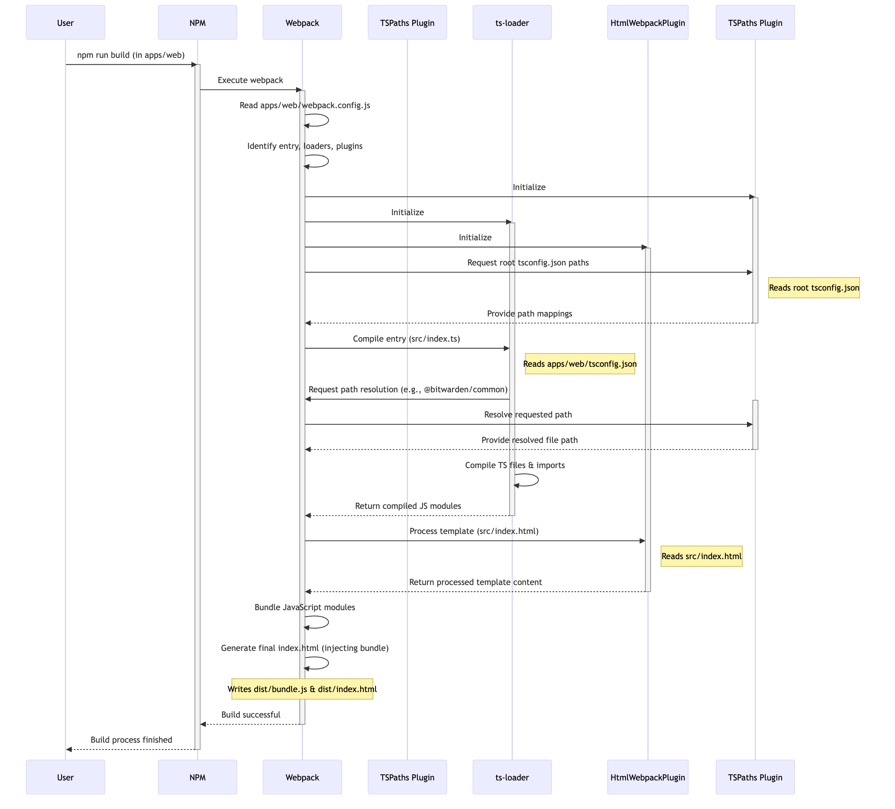
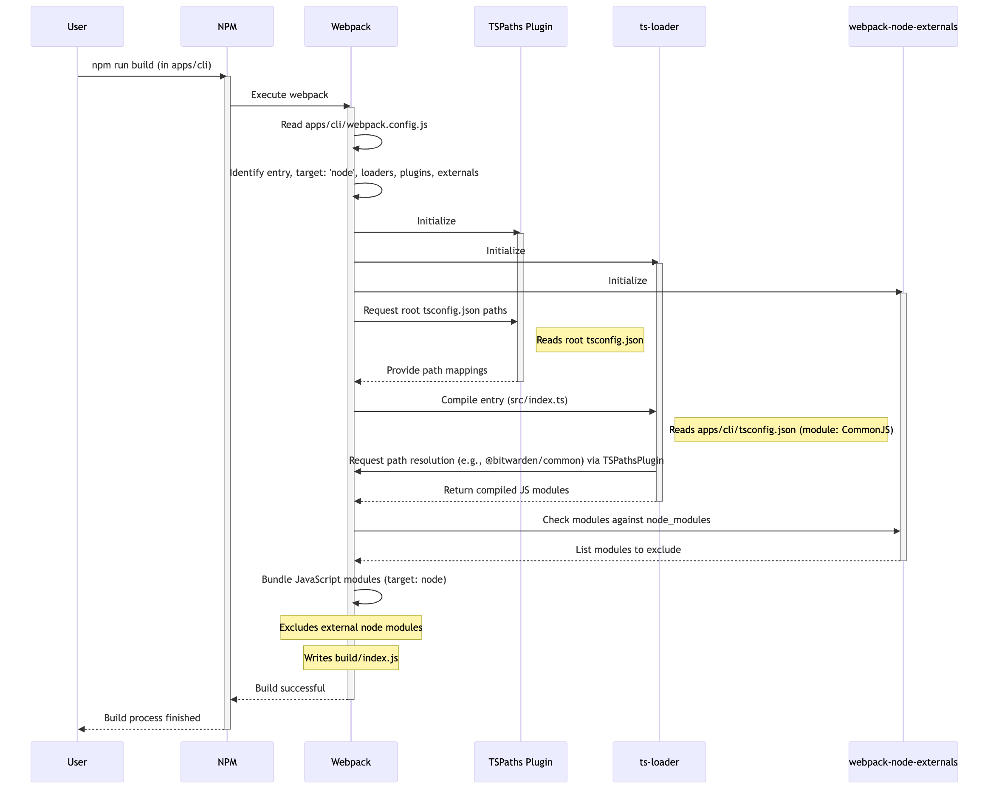
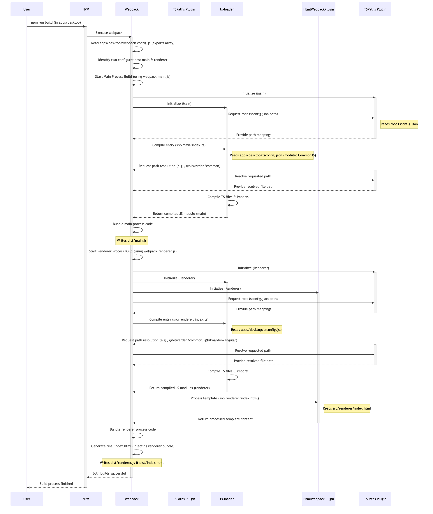
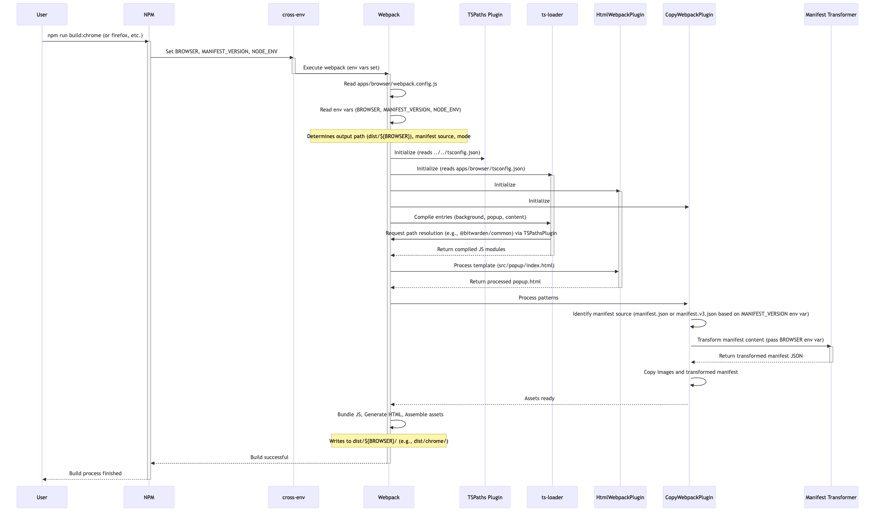
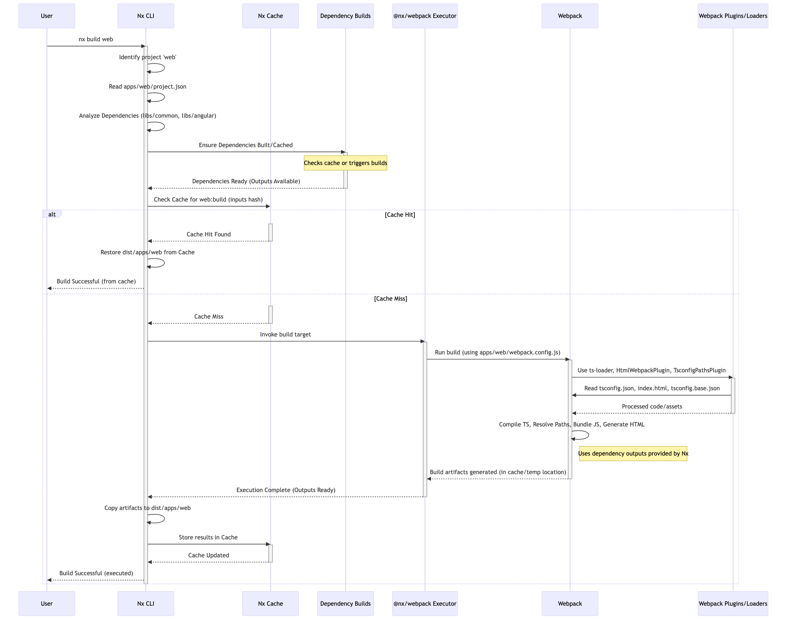
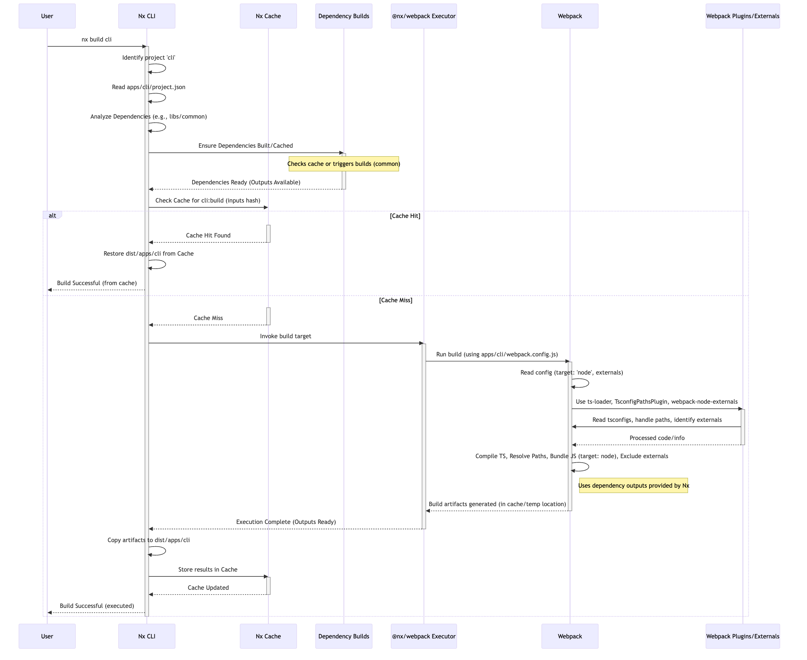
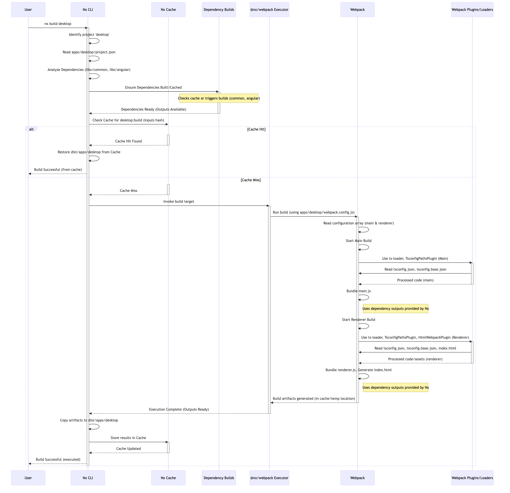
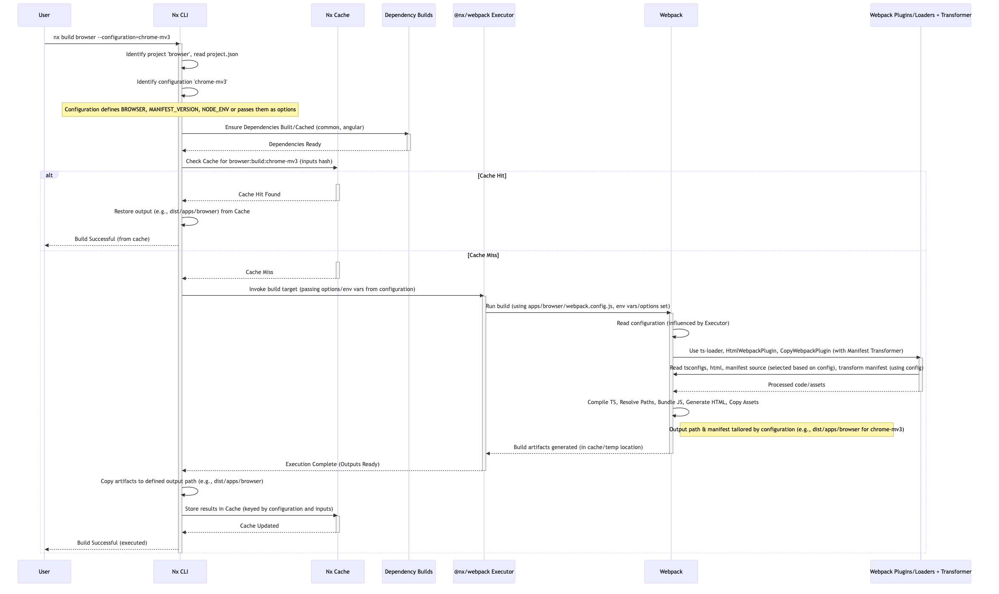

* Bitwarden Nx PoC [WIP]
This repository acts as a demonstration of what an effort to introduce Nx to the Bitwarden =clients= monorepo could look like. This PoC serves a few purposes:

1. It allows developers working on the Nx implementation to see the "full picture" before writing any changes to =clients=.
2. It serves as a planning tool during pre-development for the purpose of requirements gathering and knowledge assimalation.
3. It serves as documentation to aid engineers working in =clients= in adapting to and understanding the changes involved in the converstion.
4. During the development of introducing Nx to =clients= this repository can be used as a playground for experimentation.

** ToC
:PROPERTIES:
:TOC:      :include siblings :force (nothing) :ignore (nothing) :local (nothing)
:END:
:CONTENTS:
- [[#whats-nx-why-are-we-introducing-nx-to-the-monorepo][What's Nx? Why are we introducing Nx to the monorepo?]]
- [[#references][References]]
- [[#how-to-use-this-poc][How to Use This PoC]]
- [[#tldr-key-changes-introduced-by-nx][TL;DR: Key Changes Introduced by Nx]]
  - [[#overall-changes][Overall Changes]]
  - [[#web-app-appsweb][Web App (apps/web)]]
  - [[#cli-app-appscli][CLI App (apps/cli)]]
  - [[#desktop-app-appsdesktop][Desktop App (apps/desktop)]]
  - [[#browser-extension-appsbrowser][Browser Extension (apps/browser)]]
  - [[#libraries-libs][Libraries (libs/*)]]
- [[#briefly-looking-ahead-to-the-clients-migration][Briefly Looking Ahead To The clients Migration]]
  - [[#open-questions][Open Questions]]
  - [[#unanswered-questions][Unanswered Questions]]
  - [[#faqs][FAQs]]
  - [[#suggested-task-list-for-the-clients-migration][Suggested Task List For The clients migration]]
- [[#reading-the-commits][Reading the Commits]]
  - [[#commit-1-setting-up-the-hello-world-oonorepository][Commit 1: Setting up the "hello world" oonorepository]]
    - [[#setting-up-the-project-root][Setting up the project root]]
      - [[#gitignore][/.gitignore]]
      - [[#packagejson][/package.json]]
      - [[#tsconfigjson][/tsconfig.json]]
    - [[#setting-up-libs][Setting up /libs/]]
      - [[#libsshared][/libs/shared/]]
        - [[#libssharedtsconfigjson][/libs/shared/tsconfig.json]]
      - [[#libscommon][/libs/common/]]
        - [[#libscommonpackagejson][/libs/common/package.json]]
        - [[#libscommontsconfigjson][/libs/common/tsconfig.json]]
        - [[#libscommoncommonservicets][/libs/common/common.service.ts]]
      - [[#libsangular][/libs/angular/]]
        - [[#libsangularpackagejson][/libs/angular/package.json]]
        - [[#libsangulartsconfigjson][/libs/angular/tsconfig.json]]
        - [[#libsangularangularservicets][/libs/angular/angular.service.ts]]
    - [[#setting-up-apps][Setting up /apps/]]
      - [[#appsweb][/apps/web/]]
        - [[#appswebpackagejson][/apps/web/package.json]]
        - [[#appswebtsconfigjson][/apps/web/tsconfig.json]]
        - [[#appswebwebpackconfigjs][/apps/web/webpack.config.js]]
        - [[#appswebindexhtml][/apps/web/index.html]]
        - [[#appswebindexts][/apps/web/index.ts]]
      - [[#appscli][/apps/cli/]]
        - [[#appsclipackagejson][/apps/cli/package.json]]
        - [[#appsclitsconfigjson][/apps/cli/tsconfig.json]]
        - [[#appscliwebpackconfigjs][/apps/cli/webpack.config.js]]
        - [[#appsclisrcindexts][/apps/cli/src/index.ts]]
      - [[#appsdesktop][/apps/desktop/]]
        - [[#appsdesktopdistpackagejson][/apps/desktop/dist/package.json]]
          - [[#document-the-folder-structure-here-it-is-different][Document the folder structure here, it is different]]
        - [[#appsdesktoppackagejson][/apps/desktop/package.json]]
          - [[#document-that-these-build-commands-are-more-simple-than-main-and-why][Document that these build commands are more simple than main, and why]]
        - [[#appsdesktoptsconfigjson][/apps/desktop/tsconfig.json]]
        - [[#appsdesktopwebpackmainjs][/apps/desktop/webpack.main.js]]
        - [[#appsdesktopwebpackrendererjs][/apps/desktop/webpack.renderer.js]]
        - [[#appsdesktopwebpackconfigjs][/apps/desktop/webpack.config.js]]
        - [[#appsdesktopsrcmainindexts][/apps/desktop/src/main/index.ts]]
        - [[#appsdesktopsrcrendererindexhtml][/apps/desktop/src/renderer/index.html]]
        - [[#appsdesktopsrcrendererindexts][/apps/desktop/src/renderer/index.ts]]
      - [[#appsbrowser][/apps/browser/]]
        - [[#appsbrowserpackagejson][/apps/browser/package.json]]
        - [[#appsbrowsertsconfigjson][/apps/browser/tsconfig.json]]
        - [[#appsbrowserwebpackconfigjs][/apps/browser/webpack.config.js]]
        - [[#appsbrowsersrcbackgroundindexts][/apps/browser/src/background/index.ts]]
        - [[#appsbrowsersrcpopupindexhtml][/apps/browser/src/popup/index.html]]
        - [[#appsbrowsersrcpopupindexts][/apps/browser/src/popup/index.ts]]
        - [[#appsbrowsersrccontentindexts][/apps/browser/src/content/index.ts]]
        - [[#appsbrowsersrcmanifestjson][/apps/browser/src/manifest.json]]
        - [[#appsbrowserwebpackmanifestjs][/apps/browser/webpack/manifest.js]]
        - [[#appsbrowsersrcmanifestv3json][/apps/browser/src/manifest.v3.json]]
  - [[#commits-2-through-9-converting-to-nx][Commits 2 through 9: Converting to nx]]
    - [[#style-guide-for-migration-commits][Style Guide For Migration Commits]]
    - [[#commit-2-initialize-the-nx-workspace][Commit 2: Initialize the Nx Workspace]]
    - [[#commit-3-configure-core-workspace-settings][Commit 3: Configure Core Workspace Settings]]
    - [[#commits-4-through-5-converting-libs-projects-to-nx-projects][Commits 4 through 5: Converting libs projects to Nx projects]]
      - [[#commit-4--converting-libscommon][Commit 4:  Converting libs/common]]
      - [[#commit-5--converting-libsangular][Commit 5:  Converting libs/angular]]
    - [[#commit-6-through-9--convert-applications-to-nx-projects][Commit 6 through 9:  Convert Applications to Nx Projects]]
      - [[#commit-6-web][Commit 6: web]]
      - [[#commit-7-cli][Commit 7: cli]]
      - [[#commit-8-desktop][Commit 8: desktop]]
      - [[#commit-9-browser][Commit 9: browser]]
:END:

** What's Nx? Why are we introducing Nx to the monorepo?

Nx is a build system and set of developer tools designed specifically for monorepo development. It helps manage complex JavaScript/TypeScript projects that contain multiple applications and libraries within a single repository.

Key features of Nx we are looking to take advantage of include:

1. Workspace management
2. Intelligent build caching 
3. Dependency management and visualizations
4. Code generation tools
5. Targeted build commands from project root

Platform believes introducing Nx will provide improved build efficiency, promote consistent patterns across libs, enable a simpler development workflow, and make it easier to understand and navigate the codebase.

** References

Much of the Nx-specific information here can be sourced in the following locations:

- [[https://nx.dev/getting-started/intro][The Nx Docs]]
- [[https://nx.dev/recipes/adopting-nx][Adopting Nx Gradually]]

** How to Use This PoC

To use this repository you should take a look at the commit log. The initial commit builds a "hello world" implementation of the =clients= monorepo. Subsequent commits show an incremental conversion to using Nx.

It is the hope of this project that these steps can be followed nearly 1:1 for implementing Nx in the true monorepository.

** TL;DR: Key Changes Introduced by Nx

For developers familiar with the current =clients= build process, here's a quick summary of the main changes Nx introduces:

*** Overall Changes
- *Unified Commands:* Instead of =cd=-ing into specific app/lib directories and running =npm run build=, you'll run commands like =nx build web=, =nx build desktop=, =nx build common= from the *repository root*.
- *Build Caching:* Nx automatically caches build results. If code and dependencies haven't changed, subsequent builds will be significantly faster, often restoring results from cache instantly.
-   *Project Configuration:* Each app and library gets a =project.json= file defining its build targets (like =build=, =serve=, =lint=) and dependencies. This replaces many scripts previously defined in individual =package.json= files.
- *Dependency Management:* Each lib and app are now more independent *projects*. Nx understands the dependencies between projects. Running =nx build web= will automatically build =libs/common= and =libs/angular= first if needed. You can visualize this with =nx graph=.

*** Web App (=apps/web=)
- *Build:* Run =nx build web= from the root. (Replaces =cd apps/web && npm run build=)
- *Serve (Dev):* Run =nx serve web= from the root. (Replaces =cd apps/web && npm run build:watch= or similar webpack dev server command)
- *How:* Nx uses the existing =apps/web/webpack.config.js= via the =@nx/webpack= executor.

*** CLI App (=apps/cli=)
- *Build:* Run =nx build cli= from the root. (Replaces =cd apps/cli && npm run build=)
- *Run:* Run =nx run cli:start= (or similar defined target) from the root. (Replaces =cd apps/cli && npm run start=)
- *How:* Uses =@nx/webpack= for building and likely =@nx/node= for running the compiled output.

*** Desktop App (=apps/desktop=)
- *Build:* Run =nx build desktop= from the root. This single command builds *both* the main and renderer processes. (Replaces =cd apps/desktop && npm run build=)
- *Serve/Watch & Run:* Run =nx serve desktop= (or similar target) from the root. This will handle building/watching both processes and launching Electron. (Replaces =cd apps/desktop && npm run build:watch= which used =concurrently=).
- *How:* Nx uses =@nx/webpack=, configured to handle the array of webpack configurations (main and renderer). The serve command might use =@nx/run-commands= or a custom executor to replicate the previous watch/launch behavior.

*** Browser Extension (=apps/browser=)
- *Build:* Run =nx build browser --configuration=<config_name>= from the root, where =<config_name>= specifies the target browser and manifest version (e.g., =chrome-mv3=, =firefox-mv2=). (Replaces the various =cross-env ... npm run build:<browser>= scripts).
- *Watch:* Add the =--watch= flag, e.g., =nx build browser --configuration=chrome-mv3 --watch=.
- *How:* Nx's =configurations= feature within =apps/browser/project.json= manages the different build variants (browser target, MV2/MV3, prod/dev). Each configuration tells the =@nx/webpack= executor how to run, passing the necessary environment variables or options to the existing =apps/browser/webpack.config.js=.

*** Libraries (=libs/*=)
- *Build:* Run =nx build <library_name>= (e.g., =nx build common=) from the root. (Replaces =cd libs/common && npm run build=)
- *How:* Nx typically uses the =@nx/js:tsc= executor to compile TypeScript libraries based on their =tsconfig.json= files. Dependencies between libraries are automatically handled.

** Briefly Looking Ahead To The =clients= Migration
*** Open Questions

Here are some questions that have not been resolved yet that need to be before this PoC can be considered compelte:

1. What's the best order of conversion for Bitwarden's projects?
2. How will we handle circular dependencies if they come up?
3. Does the safari extension build create issues?

*** Unanswered Questions

Here are some questions that remain open at this stage in development of the PoC. These may introduce challenges during the migration of =clients=. Some could perhaps be demonstrated in the PoC, but none of these things are currently included.

1. Will the native rust code in desktop cause issues?
2. Will the connectors scripts for 2FA integrations cause issues?
3. Why does the storybook component library have [[*/libs/components/tsconfig.app.json][two tsconfigs?]]
4. Will storybook cause issues with Nx?
5. Should this PoC include some CI?

*** FAQs

1. Are we going to use [[https://nx.dev/nx-cloud][Nx cloud]]?
Not at first, but we will discuss this as potential followup work.

*** Suggested Task List For The =clients= migration

Based on the way this PoC went a suggested task list for the clients implementation would look something like this:

[WIP]

** Reading the Commits

These commits are written as a literate org document. With the proper tooling you could follow along, executing each code block, and recreate this repository from scratch. However, it is easy enough to follow along and read through to understand the important data points here and the changes made to them to facilitate Nx.

*** Commit 1: Setting up the "hello world" oonorepository

The first commit creates a monorepository that looks and feels like =clients=. It creates a web app, electron app, browser extension, and CLI using much of the same configuration as =clients= (respective to the current date). 

**** Setting up the project root
***** =/.gitignore=

#+begin_src text :tangle .gitignore
node_modules
#+end_src

***** =/package.json=

Next we'll initialize the root level =package.json=. It needs to contain all the dependencies from across the project. It also needs to contain build scripts for running each project.

#+begin_src json :tangle package.json
{
  "name": "bitwarden-clients-poc",
  "version": "0.0.1",
  "private": true,
  "workspaces": [
    "apps/*",
    "libs/**/*"
  ],
  "scripts": {
    "lint": "eslint . --cache --cache-strategy content && prettier --check .",
    "lint:fix": "eslint . --cache --cache-strategy content --fix"
  },
  "devDependencies": {
    "@types/chrome": "0.0.280",
    "concurrently": "9.1.2",
    "copy-webpack-plugin": "12.0.2",
    "cross-env": "7.0.3",
    "electron": "34.0.0",
    "electron-builder": "24.13.3",
    "electron-log": "5.2.4",
    "electron-reload": "2.0.0-alpha.1",
    "electron-store": "8.2.0",
    "electron-updater": "6.3.9",
    "html-loader": "5.1.0",
    "html-webpack-plugin": "5.6.3",
    "ts-loader": "9.5.2",
    "tsconfig-paths-webpack-plugin": "4.2.0",
    "typescript": "5.4.2",
    "webpack": "5.97.1",
    "webpack-cli": "6.0.1",
    "webpack-dev-server": "5.2.0",
    "webpack-dev-server": "5.2.0",
    "webpack-node-externals": "3.0.0"
  },
  "dependencies": {
    "@angular/animations": "18.2.13",
    "@angular/cdk": "18.2.14",
    "@angular/common": "18.2.13",
    "@angular/compiler": "18.2.13",
    "@angular/core": "18.2.13",
    "@angular/forms": "18.2.13",
    "@angular/platform-browser": "18.2.13",
    "@angular/platform-browser-dynamic": "18.2.13",
    "@angular/router": "18.2.13",
    "commander": "11.1.0",
    "node-fetch": "2.6.12",
    "node-forge": "1.3.1"
  },
  "engines": {
    "node": "~20",
    "npm": "~10"
  }
}
#+end_src

***** =/tsconfig.json=

Next we'll initilize the root tsconfig.json. It needs to set up targets, paths, and includes.

#+begin_src json :tangle tsconfig.json
{
  "compilerOptions": {
    "strict": false,
    "pretty": true,
    "moduleResolution": "node",
    "noImplicitAny": true,
    "target": "ES2016",
    "module": "ES2020",
    "lib": ["es5", "es6", "es7", "dom", "ES2021", "ESNext.Disposable"],
    "sourceMap": true,
    "allowSyntheticDefaultImports": true,
    "experimentalDecorators": true,
    "emitDecoratorMetadata": true,
    "declaration": false,
    "outDir": "dist",
    "baseUrl": ".",
    "resolveJsonModule": true,
    "paths": {
      "@bitwarden/angular/*": ["./libs/angular/src/*"],
      "@bitwarden/common/*": ["./libs/common/src/*"],
      "@bitwarden/components/*": ["./libs/components/src/*"]
    },
  },
  "include": [
    "apps/web/src/**/*",
    "libs/*/src/**/*"
  ]
}
#+end_src

**** Setting up =/libs/=
=libs= is a core component of the bitwarden monorepo and holds all shared code across clients. This directory holds independently buildable libraries that may have some level of dependency on one another. We've stubbed out a few examples for the PoC, but this isn't a 1:1 recreation of =clients=.
***** =/libs/shared/=
****** =/libs/shared/tsconfig.json=

Libs maintains a parent =tsconfig.json= that is inheritted by others. 

#+begin_src json :tangle libs/shared/tsconfig.json :mkdirp yes
{
  "compilerOptions": {
    "pretty": true,
    "moduleResolution": "node",
    "noImplicitAny": true,
    "target": "ES6",
    "module": "es2020",
    "lib": ["es5", "es6", "es7", "dom"],
    "sourceMap": true,
    "allowSyntheticDefaultImports": true,
    "experimentalDecorators": true,
    "emitDecoratorMetadata": true,
    "outDir": "dist",
    "plugins": [
      {
        "name": "typescript-strict-plugin"
      }
    ]
  }
}
#+end_src

***** =/libs/common/=
****** =/libs/common/package.json=

#+begin_src json :tangle libs/common/package.json :mkdirp yes
{
  "name": "@bitwarden/common",
  "version": "0.0.0",
  "description": "Common code used across Bitwarden JavaScript projects.",
  "keywords": [
    "bitwarden"
  ],
  "author": "Bitwarden Inc.",
  "homepage": "https://bitwarden.com",
  "repository": {
    "type": "git",
    "url": "https://github.com/bitwarden/jslib"
  },
  "license": "GPL-3.0",
  "scripts": {
    "build": "npm run clean && tsc"
  }
}
#+end_src

****** =/libs/common/tsconfig.json=

And then =tsconfig.json=. This references the root config.

#+begin_src json :tangle libs/common/tsconfig.json :mkdirp yes
{
  "extends": "../../tsconfig.json",
  "compilerOptions": {
    "outDir": "./dist"
  },
  "include": ["src/**/*"]
}
#+end_src

****** =/libs/common/common.service.ts=

Next we'll create an entrypoint for the =common= lib. It should serves as a "Hello World" for the library. It also acts as a dependency for other libs.

#+begin_src ts :tangle libs/common/common.service.ts :mkdirp yes
export class CommonService {
  getMessage(lib: string = "common"): string {
    return `Hello from the ${lib} library!`;
  }
}
#+end_src

***** =/libs/angular/=
****** =/libs/angular/package.json=

#+begin_src json :tangle libs/angular/package.json :mkdirp yes
{
  "name": "@bitwarden/angular",
  "version": "0.0.0",
  "description": "Common code used across Bitwarden JavaScript projects.",
  "keywords": [
    "bitwarden"
  ],
  "author": "Bitwarden Inc.",
  "homepage": "https://bitwarden.com",
  "repository": {
    "type": "git",
    "url": "https://github.com/bitwarden/jslib"
  },
  "license": "GPL-3.0",
  "scripts": {
    "clean": "rimraf dist",
    "build": "npm run clean && tsc",
    "build:watch": "npm run clean && tsc -watch"
  }
}
#+end_src

****** =/libs/angular/tsconfig.json=

One important thing to note: we should be able to reference libs inside each other like this.

#+begin_src json :tangle libs/angular/tsconfig.json :mkdirp yes
{
  "extends": "../shared/tsconfig",
  "compilerOptions": {
    "paths": {
      "@bitwarden/common/*": ["../common/src/*"]
    }
  },
  "include": ["src", "spec"],
  "exclude": ["node_modules", "dist"]
}
#+end_src

****** =/libs/angular/angular.service.ts=

#+begin_src ts :tangle libs/angular/angular.service.ts :mkdirp yes
import { CommonService } from '@bitwarden/common/common.service';
export class AngularService {
  private commonService = new CommonService();

  getMessage(): string {
    return this.commonService.getMessage("angular");
  }
}
#+end_src

**** Setting up =/apps/=
***** =/apps/web/=

The end result of this configuration is a build that operates like this:

#+begin_src mermaid :file diagrams/web-pre-nx.png :results file :scale 3
sequenceDiagram
    participant User
    participant NPM
    participant Webpack
    participant TsconfigPathsPlugin as TSPaths Plugin
    participant TSLoader as ts-loader
    participant HTMLPlugin as HtmlWebpackPlugin

    User->>NPM: npm run build (in apps/web)
    activate NPM
    NPM->>Webpack: Execute webpack
    activate Webpack

    Webpack->>Webpack: Read apps/web/webpack.config.js
    Webpack->>Webpack: Identify entry, loaders, plugins
    Webpack->>TSPaths Plugin: Initialize
    activate TSPaths Plugin
    Webpack->>TSLoader: Initialize
    activate TSLoader
    Webpack->>HTMLPlugin: Initialize
    activate HTMLPlugin

    Webpack->>TSPaths Plugin: Request root tsconfig.json paths
    Note right of TSPaths Plugin: Reads root tsconfig.json
    TSPaths Plugin-->>Webpack: Provide path mappings
    deactivate TSPaths Plugin

    Webpack->>TSLoader: Compile entry (src/index.ts)
    Note right of TSLoader: Reads apps/web/tsconfig.json
    TSLoader->>Webpack: Request path resolution (e.g., @bitwarden/common)
    activate TSPaths Plugin
    Webpack->>TSPaths Plugin: Resolve requested path
    TSPaths Plugin-->>Webpack: Provide resolved file path
    deactivate TSPaths Plugin
    TSLoader->>TSLoader: Compile TS files & imports
    TSLoader-->>Webpack: Return compiled JS modules
    deactivate TSLoader

    Webpack->>HTMLPlugin: Process template (src/index.html)
    Note right of HTMLPlugin: Reads src/index.html
    HTMLPlugin-->>Webpack: Return processed template content
    deactivate HTMLPlugin

    Webpack->>Webpack: Bundle JavaScript modules
    Webpack->>Webpack: Generate final index.html (injecting bundle)

    Note over Webpack: Writes dist/bundle.js & dist/index.html
    Webpack-->>NPM: Build successful
    deactivate Webpack
    NPM-->>User: Build process finished
    deactivate NPM
#+end_src

#+RESULTS:

****** =/apps/web/package.json=
#+begin_src json :tangle apps/web/package.json :mkdirp yes
{
  "name": "@bitwarden/web",
  "version": "0.0.1",
  "scripts": {
    "build": "webpack",
    "build:watch": "webpack serve"
  }
}
#+end_src
****** =/apps/web/tsconfig.json=
#+begin_src json :tangle apps/web/tsconfig.json :mkdirp yes
{
  "extends": "../../libs/shared/tsconfig",
  "compilerOptions": {
    "baseUrl": ".",
    "module": "ES2020",
    "resolveJsonModule": true,
    "paths": {
      "@bitwarden/common/*": ["../../libs/common/src/*"],
      "@bitwarden/angular/*": ["../../libs/angular/src/*"],
    }
  }
}
#+end_src

****** =/apps/web/webpack.config.js=
#+begin_src js :tangle apps/web/webpack.config.js :mkdirp yes
const path = require('path');
const HtmlWebpackPlugin = require('html-webpack-plugin');
const TsconfigPathsPlugin = require('tsconfig-paths-webpack-plugin');

module.exports = {
  entry: './src/index.ts',
  mode: 'development',
  module: {
    rules: [
      {
        test: /\.ts$/,
        use: 'ts-loader',
        exclude: /node_modules/,
      },
    ],
  },
  resolve: {
    extensions: ['.ts', '.js'],
    plugins: [new TsconfigPathsPlugin()],
  },
  output: {
    filename: 'bundle.js',
    path: path.resolve(__dirname, 'dist'),
  },
  plugins: [
    new HtmlWebpackPlugin({
      template: './src/index.html',
    }),
  ],
  devServer: {
    static: './dist',
    hot: true,
  },
};
#+end_src

****** =/apps/web/index.html=

#+begin_src html :tangle apps/web/src/index.html :mkdirp yes
<!DOCTYPE html>
<html>
<head>
  <meta charset="utf-8">
  <title>Bitwarden Web PoC</title>
</head>
<body>
  

    <h1>Bitwarden Web</h1>
    

    

  

</body>
</html>
#+end_src

****** =/apps/web/index.ts=

#+begin_src ts :tangle apps/web/src/index.ts :mkdirp yes
import { CommonService } from '@bitwarden/common/common.service'
import { AngularService } from '@bitwarden/angular/angular.service'

const commonService = new CommonService();
const angularService = new AngularService();
document.getElementById('commonMessage').textContent = commonService.getMessage();
document.getElementById('angularMessage').textContent = angularService.getMessage();
#+end_src

***** =/apps/cli/=

#+begin_src mermaid :file diagrams/cli-pre-nx.png :results file :scale 3
sequenceDiagram
    participant User
    participant NPM
    participant Webpack
    participant TSPathsPlugin as TSPaths Plugin
    participant TSLoader as ts-loader
    participant NodeExternals as webpack-node-externals

    User->>NPM: npm run build (in apps/cli)
    activate NPM
    NPM->>Webpack: Execute webpack
    activate Webpack

    Webpack->>Webpack: Read apps/cli/webpack.config.js
    Webpack->>Webpack: Identify entry, target: 'node', loaders, plugins, externals
    Webpack->>TSPathsPlugin: Initialize
    activate TSPathsPlugin
    Webpack->>TSLoader: Initialize
    activate TSLoader
    Webpack->>NodeExternals: Initialize
    activate NodeExternals

    Webpack->>TSPathsPlugin: Request root tsconfig.json paths
    Note right of TSPathsPlugin: Reads root tsconfig.json
    TSPathsPlugin-->>Webpack: Provide path mappings
    deactivate TSPathsPlugin

    Webpack->>TSLoader: Compile entry (src/index.ts)
    Note right of TSLoader: Reads apps/cli/tsconfig.json (module: CommonJS)
    TSLoader->>Webpack: Request path resolution (e.g., @bitwarden/common) via TSPathsPlugin
    TSLoader-->>Webpack: Return compiled JS modules
    deactivate TSLoader

    Webpack->>NodeExternals: Check modules against node_modules
    NodeExternals-->>Webpack: List modules to exclude
    deactivate NodeExternals

    Webpack->>Webpack: Bundle JavaScript modules (target: node)
    Note over Webpack: Excludes external node modules

    Note over Webpack: Writes build/index.js
    Webpack-->>NPM: Build successful
    deactivate Webpack
    NPM-->>User: Build process finished
    deactivate NPM
#+end_src

#+RESULTS:

****** =/apps/cli/package.json=

The CLI app has its own npm scripts for building and running the application.

#+begin_src json :tangle apps/cli/package.json :mkdirp yes
{
  "name": "@bitwarden/cli",
  "version": "0.0.1",
  "description": "Bitwarden CLI PoC",
  "main": "build/index.js",
  "scripts": {
    "build": "webpack",
    "start": "node build/index.js"
  }
}
#+end_src

****** =/apps/cli/tsconfig.json=

The CLI requires Node.js module format and specific paths for the library dependencies.

#+begin_src json :tangle apps/cli/tsconfig.json :mkdirp yes
{
  "extends": "../../libs/shared/tsconfig",
  "compilerOptions": {
    "baseUrl": ".",
    "module": "CommonJS",
    "target": "ES2020",
    "resolveJsonModule": true,
    "paths": {
      "@bitwarden/common/*": ["../../libs/common/src/*"],
      "@bitwarden/angular/*": ["../../libs/angular/src/*"]
    }
  },
  "include": ["src/**/*"]
}
#+end_src

****** =/apps/cli/webpack.config.js=

The CLI webpack configuration is simpler as it's for a Node.js application without browser components.

#+begin_src js :tangle apps/cli/webpack.config.js :mkdirp yes
const path = require('path');
const TsconfigPathsPlugin = require('tsconfig-paths-webpack-plugin');
const nodeExternals = require('webpack-node-externals');

module.exports = {
  entry: './src/index.ts',
  target: 'node',
  mode: 'development',
  module: {
    rules: [
      {
        test: /\.ts$/,
        use: 'ts-loader',
        exclude: /node_modules/,
      },
    ],
  },
  resolve: {
    extensions: ['.ts', '.js'],
    plugins: [new TsconfigPathsPlugin()],
  },
  output: {
    filename: 'index.js',
    path: path.resolve(__dirname, 'build'),
  },
  externals: [nodeExternals()],
  node: {
    __dirname: false,
    __filename: false,
  }
};
#+end_src

****** =/apps/cli/src/index.ts=

The CLI entrypoint implements a simple command-line interface using Commander, similar to the real Bitwarden CLI.

#+begin_src ts :tangle apps/cli/src/index.ts :mkdirp yes
import { Command } from 'commander';
import { CommonService } from '@bitwarden/common/common.service';

const program = new Command();
const commonService = new CommonService();

program
  .name('bw')
  .description('Bitwarden Command-line Interface (Nx PoC)')
  .version('0.0.1');

program
  .command('hello')
  .description('Test connection to libraries')
  .action(() => {
    console.log(commonService.getMessage());
  });

program
  .command('*', { hidden: true })
  .action((cmd) => {
    console.error(`Unknown command: ${cmd}`);
    program.help();
  });

program.parse(process.argv);

if (process.argv.length <= 2) {
  program.help();
}
#+end_src

***** =/apps/desktop/=

This diagram shows how the desktop app is built using npm scripts and webpack directly within its own directory before Nx is introduced. Webpack handles both the main and renderer process builds based on the configuration array.

#+begin_src mermaid :file diagrams/desktop-pre-nx.png :results file :scale 3
sequenceDiagram
    participant User
    participant NPM
    participant Webpack
    participant TsconfigPathsPlugin as TSPaths Plugin
    participant TSLoader as ts-loader
    participant HTMLPlugin as HtmlWebpackPlugin

    User->>NPM: npm run build (in apps/desktop)
    activate NPM
    NPM->>Webpack: Execute webpack
    activate Webpack

    Webpack->>Webpack: Read apps/desktop/webpack.config.js (exports array)
    Webpack->>Webpack: Identify two configurations: main & renderer

    %% Main Process Build
    Webpack->>Webpack: Start Main Process Build (using webpack.main.js)
    Webpack->>TSPaths Plugin: Initialize (Main)
    activate TSPaths Plugin
    Webpack->>TSLoader: Initialize (Main)
    activate TSLoader

    Webpack->>TSPaths Plugin: Request root tsconfig.json paths
    Note right of TSPaths Plugin: Reads root tsconfig.json
    TSPaths Plugin-->>Webpack: Provide path mappings
    deactivate TSPaths Plugin

    Webpack->>TSLoader: Compile entry (src/main/index.ts)
    Note right of TSLoader: Reads apps/desktop/tsconfig.json (module: CommonJS)
    TSLoader->>Webpack: Request path resolution (e.g., @bitwarden/common)
    activate TSPaths Plugin
    Webpack->>TSPaths Plugin: Resolve requested path
    TSPaths Plugin-->>Webpack: Provide resolved file path
    deactivate TSPaths Plugin
    TSLoader->>TSLoader: Compile TS files & imports
    TSLoader-->>Webpack: Return compiled JS module (main)
    deactivate TSLoader

    Webpack->>Webpack: Bundle main process code

    Note over Webpack: Writes dist/main.js

    %% Renderer Process Build
    Webpack->>Webpack: Start Renderer Process Build (using webpack.renderer.js)
    Webpack->>TSPaths Plugin: Initialize (Renderer)
    activate TSPaths Plugin
    Webpack->>TSLoader: Initialize (Renderer)
    activate TSLoader
    Webpack->>HTMLPlugin: Initialize (Renderer)
    activate HTMLPlugin

    Webpack->>TSPaths Plugin: Request root tsconfig.json paths
    TSPaths Plugin-->>Webpack: Provide path mappings
    deactivate TSPaths Plugin

    Webpack->>TSLoader: Compile entry (src/renderer/index.ts)
    Note right of TSLoader: Reads apps/desktop/tsconfig.json
    TSLoader->>Webpack: Request path resolution (e.g., @bitwarden/common, @bitwarden/angular)
    activate TSPaths Plugin
    Webpack->>TSPaths Plugin: Resolve requested path
    TSPaths Plugin-->>Webpack: Provide resolved file path
    deactivate TSPaths Plugin
    TSLoader->>TSLoader: Compile TS files & imports
    TSLoader-->>Webpack: Return compiled JS modules (renderer)
    deactivate TSLoader

    Webpack->>HTMLPlugin: Process template (src/renderer/index.html)
    Note right of HTMLPlugin: Reads src/renderer/index.html
    HTMLPlugin-->>Webpack: Return processed template content
    deactivate HTMLPlugin

    Webpack->>Webpack: Bundle renderer process code
    Webpack->>Webpack: Generate final index.html (injecting renderer bundle)

    Note over Webpack: Writes dist/renderer.js & dist/index.html

    Webpack-->>NPM: Both builds successful
    deactivate Webpack
    NPM-->>User: Build process finished
    deactivate NPM
#+end_src

#+RESULTS:

****** =/apps/desktop/dist/package.json=

#+begin_src json :tangle apps/desktop/dist/package.json :mkdirp yes
{
  "name": "bitwarden-desktop-app",
  "main": "main.js"
}
#+end_src

******* TODO Document the folder structure here, it is different

****** =/apps/desktop/package.json=

#+begin_src json :tangle apps/desktop/package.json :mkdirp yes
{
  "name": "@bitwarden/desktop",
  "version": "0.0.1",
  "scripts": {
    "build": "webpack",
    "build:watch": "concurrently \"webpack --watch\" \"electron dist\""
  }
}
#+end_src

******* TODO Document that these build commands are more simple than main, and why

****** =/apps/desktop/tsconfig.json=
#+begin_src json :tangle apps/desktop/tsconfig.json :mkdirp yes
{
  "extends": "../../libs/shared/tsconfig",
  "compilerOptions": {
    "baseUrl": ".",
    "module": "CommonJS",
    "resolveJsonModule": true,
    "paths": {
      "@bitwarden/common/*": ["../../libs/common/src/*"],
      "@bitwarden/angular/*": ["../../libs/angular/src/*"]
    }
  }
}
#+end_src

****** =/apps/desktop/webpack.main.js=
#+begin_src js :tangle apps/desktop/webpack.main.js :mkdirp yes
const path = require('path');
const TsconfigPathsPlugin = require('tsconfig-paths-webpack-plugin');

module.exports = {
  entry: './src/main/index.ts',
  target: 'electron-main',
  mode: 'development',
  module: {
    rules: [
      {
        test: /\.ts$/,
        use: 'ts-loader',
        exclude: /node_modules/,
      },
    ],
  },
  resolve: {
    extensions: ['.ts', '.js'],
    plugins: [new TsconfigPathsPlugin()],
  },
  output: {
    filename: 'main.js',
    path: path.resolve(__dirname, 'dist'),
  },
};
#+end_src

****** =/apps/desktop/webpack.renderer.js=
#+begin_src js :tangle apps/desktop/webpack.renderer.js :mkdirp yes
const path = require('path');
const HtmlWebpackPlugin = require('html-webpack-plugin');
const TsconfigPathsPlugin = require('tsconfig-paths-webpack-plugin');

module.exports = {
  entry: './src/renderer/index.ts',
  target: 'electron-renderer',
  mode: 'development',
  module: {
    rules: [
      {
        test: /\.ts$/,
        use: 'ts-loader',
        exclude: /node_modules/,
      },
    ],
  },
  resolve: {
    extensions: ['.ts', '.js'],
    plugins: [new TsconfigPathsPlugin()],
  },
  output: {
    filename: 'renderer.js',
    path: path.resolve(__dirname, 'dist'),
  },
  plugins: [
    new HtmlWebpackPlugin({
      template: './src/renderer/index.html',
    }),
  ],
};
#+end_src

****** =/apps/desktop/webpack.config.js=

This config re-exports the main and renderer configs. This isn't a thing on =main= but is a simple helper here.

#+begin_src js :tangle apps/desktop/webpack.config.js :mkdirp yes
const mainConfig = require('./webpack.main');
const rendererConfig = require('./webpack.renderer');

module.exports = [mainConfig, rendererConfig];
#+end_src

****** =/apps/desktop/src/main/index.ts=
#+begin_src ts :tangle apps/desktop/src/main/index.ts :mkdirp yes
import { app, BrowserWindow } from 'electron';
import * as path from 'path';
import { CommonService } from '@bitwarden/common/common.service';

const commonService = new CommonService();

let mainWindow: BrowserWindow;

function createWindow() {
  mainWindow = new BrowserWindow({
    width: 800,
    height: 600,
    webPreferences: {
      nodeIntegration: true,
      contextIsolation: false,
    },
  });

  mainWindow.loadFile(path.join(__dirname, 'index.html'));

  console.log(commonService.getMessage('desktop-main'));
}

app.whenReady().then(() => {
  createWindow();
});

app.on('window-all-closed', () => {
  if (process.platform !== 'darwin') {
    app.quit();
  }
});

app.on('activate', () => {
  if (BrowserWindow.getAllWindows().length === 0) {
    createWindow();
  }
});
#+end_src

****** =/apps/desktop/src/renderer/index.html=
#+begin_src html :tangle apps/desktop/src/renderer/index.html :mkdirp yes
<!DOCTYPE html>
<html>
<head>
  <meta charset="utf-8">
  <title>Bitwarden Desktop PoC</title>
</head>
<body>
  

    <h1>Bitwarden Desktop</h1>
    

    

  

</body>
</html>
#+end_src

****** =/apps/desktop/src/renderer/index.ts=
#+begin_src ts :tangle apps/desktop/src/renderer/index.ts :mkdirp yes
import { CommonService } from '@bitwarden/common/common.service';
import { AngularService } from '@bitwarden/angular/angular.service';

const commonService = new CommonService();
const angularService = new AngularService();

document.getElementById('commonMessage').textContent = commonService.getMessage();
document.getElementById('angularMessage').textContent = angularService.getMessage();
#+end_src

***** =/apps/browser/=
The browser extension is a complex application that requires special considerations for each browser and different manifest versions.

One important thing to note about the extension: icons are required by browsers. These have been committed directely to the repo and are not tangled from this README.

This diagram shows the pre-Nx build process for the browser extension. Note how environment variables set via `cross-env` control the webpack configuration, determining the target browser, manifest version, and output directory. The manifest transformation happens within the webpack build via `CopyWebpackPlugin` and a custom transformer script.

#+begin_src mermaid :file diagrams/browser-pre-nx.png :results file :scale 3
sequenceDiagram
    participant User
    participant NPM
    participant CrossEnv as cross-env
    participant Webpack
    participant TSPathsPlugin as TSPaths Plugin
    participant TSLoader as ts-loader
    participant HTMLPlugin as HtmlWebpackPlugin
    participant CopyPlugin as CopyWebpackPlugin
    participant ManifestTransformer as Manifest Transformer

    User->>NPM: npm run build:chrome (or firefox, etc.)
    activate NPM
    NPM->>CrossEnv: Set BROWSER, MANIFEST_VERSION, NODE_ENV
    activate CrossEnv
    CrossEnv->>Webpack: Execute webpack (env vars set)
    deactivate CrossEnv
    activate Webpack

    Webpack->>Webpack: Read apps/browser/webpack.config.js
    Webpack->>Webpack: Read env vars (BROWSER, MANIFEST_VERSION, NODE_ENV)
    Note over Webpack: Determines output path (dist/${BROWSER}), manifest source, mode

    Webpack->>TSPathsPlugin: Initialize (reads ../../tsconfig.json)
    activate TSPathsPlugin
    Webpack->>TSLoader: Initialize (reads apps/browser/tsconfig.json)
    activate TSLoader
    Webpack->>HTMLPlugin: Initialize
    activate HTMLPlugin
    Webpack->>CopyPlugin: Initialize
    activate CopyPlugin

    Webpack->>TSLoader: Compile entries (background, popup, content)
    TSLoader->>Webpack: Request path resolution (e.g., @bitwarden/common) via TSPathsPlugin
    TSLoader-->>Webpack: Return compiled JS modules
    deactivate TSLoader

    Webpack->>HTMLPlugin: Process template (src/popup/index.html)
    HTMLPlugin-->>Webpack: Return processed popup.html
    deactivate HTMLPlugin

    Webpack->>CopyPlugin: Process patterns
    CopyPlugin->>CopyPlugin: Identify manifest source (manifest.json or manifest.v3.json based on MANIFEST_VERSION env var)
    CopyPlugin->>ManifestTransformer: Transform manifest content (pass BROWSER env var)
    activate ManifestTransformer
    ManifestTransformer-->>CopyPlugin: Return transformed manifest JSON
    deactivate ManifestTransformer
    CopyPlugin->>CopyPlugin: Copy images and transformed manifest
    CopyPlugin-->>Webpack: Assets ready

    Webpack->>Webpack: Bundle JS, Generate HTML, Assemble assets
    Note over Webpack: Writes to dist/${BROWSER}/ (e.g., dist/chrome/)
    Webpack-->>NPM: Build successful
    deactivate Webpack
    NPM-->>User: Build process finished
    deactivate NPM
#+end_src

#+RESULTS:

****** =/apps/browser/package.json=
The package scripts use =cross-env= to set environment variables like =BROWSER= and =MANIFEST_VERSION=, controlling which manifest version and browser-specific settings are used during the build. Firefox defaults to MV2.

#+begin_src json :tangle apps/browser/package.json :mkdirp yes
{
  "name": "@bitwarden/browser",
  "version": "0.0.1",
  "description": "Bitwarden Browser Extension PoC",
  "scripts": {
    "build": "npm run build:chrome",
    "build:dev": "cross-env NODE_ENV=development npm run build",
    "build:prod": "cross-env NODE_ENV=production npm run build",
    "build:watch": "npm run build:chrome -- --watch",

    "build:chrome": "cross-env BROWSER=chrome MANIFEST_VERSION=3 webpack",
    "build:watch:chrome": "npm run build:chrome -- --watch",

    "build:firefox": "cross-env BROWSER=firefox webpack",
    "build:watch:firefox": "npm run build:firefox -- --watch",
    "build:firefox:mv3": "cross-env BROWSER=firefox MANIFEST_VERSION=3 webpack",
    "build:watch:firefox:mv3": "npm run build:firefox:mv3 -- --watch",

    "build:edge": "cross-env BROWSER=edge MANIFEST_VERSION=3 webpack",
    "build:watch:edge": "npm run build:edge -- --watch",

    "build:opera": "cross-env BROWSER=opera MANIFEST_VERSION=3 webpack",
    "build:watch:opera": "npm run build:opera -- --watch"
  }
}
#+end_src

#+begin_src org
****** =/apps/browser/tsconfig.json=
#+begin_src json :tangle apps/browser/tsconfig.json :mkdirp yes
{
  "extends": "../../libs/shared/tsconfig",
  "compilerOptions": {
    "baseUrl": ".",
    "module": "ES2020",
    "resolveJsonModule": true,
    "paths": {
      "@bitwarden/common/*": ["../../libs/common/src/*"],
      "@bitwarden/angular/*": ["../../libs/angular/src/*"]
    },
    "types": ["chrome"]
  },
  "include": ["src/**/*"]
}
#+end_src

****** =/apps/browser/webpack.config.js=

#+begin_src js :tangle apps/browser/webpack.config.js :mkdirp yes
const path = require('path');
const HtmlWebpackPlugin = require('html-webpack-plugin');
const TsconfigPathsPlugin = require('tsconfig-paths-webpack-plugin');
const CopyWebpackPlugin = require('copy-webpack-plugin');
const manifest = require('./webpack/manifest'); // Import the transformer

// --- Start Added/Modified ---
const browser = process.env.BROWSER || 'chrome';
const isProduction = process.env.NODE_ENV === 'production';
// Read MANIFEST_VERSION, default to 2 if not set or not 3
const manifestVersion = process.env.MANIFEST_VERSION == 3 ? 3 : 2;

console.log(`Building for ${browser}, Manifest Version ${manifestVersion}, Mode: ${isProduction ? 'production' : 'development'}`);
// --- End Added/Modified ---

module.exports = {
  mode: isProduction ? 'production' : 'development',
  devtool: isProduction ? false : 'eval-source-map', // Use false for prod source maps if needed later, eval... is faster for dev
  entry: {
    background: './src/background/index.ts',
    popup: './src/popup/index.ts',
    content: './src/content/index.ts'
  },
  output: {
    // Output path now includes the browser name
    path: path.resolve(__dirname, 'dist', browser),
    filename: '[name].js',
    clean: true // Clean the output directory before build
  },
  resolve: {
    extensions: ['.ts', '.js'],
    plugins: [new TsconfigPathsPlugin({
      // Point to the correct root tsconfig for path resolution
      configFile: '../../tsconfig.json'
    })]
  },
  module: {
    rules: [
      {
        test: /\.ts$/,
        loader: 'ts-loader', // Ensure ts-loader is used
        exclude: /node_modules/,
        options: {
          // Point ts-loader to the correct tsconfig for the app
          configFile: 'tsconfig.json'
        }
      },
      {
        test: /\.(html)$/,
        use: 'html-loader'
      }
    ]
  },
  plugins: [
    new HtmlWebpackPlugin({
      template: './src/popup/index.html',
      filename: 'popup.html',
      chunks: ['popup']
    }),
    new CopyWebpackPlugin({
      patterns: [
        // --- Start Modified ---
        // Conditionally copy the correct manifest and apply transformations
        {
          from: manifestVersion === 3 ? './src/manifest.v3.json' : './src/manifest.json',
          to: 'manifest.json',
          // Pass the target browser to the transform function
          transform: manifest.transform(browser),
        },
        // --- End Modified ---
        {
          from: './src/images', // Assumes images are in src/images
          to: 'images'
        }
        // Add other static assets if needed (e.g., _locales)
      ]
    })
    // Add other plugins like DefinePlugin if needed for env variables in code
  ],
  // Add target based on MV version if needed later (e.g., webworker for MV3 background)
  // target: manifestVersion === 3 && browser !== 'firefox' ? 'webworker' : 'web',
};
#+end_src
****** =/apps/browser/src/background/index.ts=
#+begin_src ts :tangle apps/browser/src/background/index.ts :mkdirp yes
import { CommonService } from '@bitwarden/common/common.service';

const commonService = new CommonService();

console.log(commonService.getMessage());

chrome.runtime.onMessage.addListener((message: any, sender: chrome.runtime.MessageSender, sendResponse: (response: any) => void) => {
  if (message.action === 'getHello') {
    sendResponse({ message: commonService.getMessage('browser-background') });
  }
  return true;
});
#+end_src

****** =/apps/browser/src/popup/index.html=
#+begin_src html :tangle apps/browser/src/popup/index.html :mkdirp yes
<!DOCTYPE html>
<html>
<head>
  <meta charset="utf-8">
  <title>Bitwarden</title>
  <meta name="viewport" content="width=device-width, initial-scale=1">
</head>
<body>
  

    <h1>Bitwarden Browser Extension</h1>
    

    

  

</body>
</html>
#+end_src

****** =/apps/browser/src/popup/index.ts=
#+begin_src ts :tangle apps/browser/src/popup/index.ts :mkdirp yes
import { CommonService } from '@bitwarden/common/common.service';
import { AngularService } from '@bitwarden/angular/angular.service';

const commonService = new CommonService();
const angularService = new AngularService();

document.getElementById('commonMessage').textContent = commonService.getMessage();
document.getElementById('angularMessage').textContent = angularService.getMessage();
#+end_src

****** =/apps/browser/src/content/index.ts=
#+begin_src ts :tangle apps/browser/src/content/index.ts :mkdirp yes
import { CommonService } from '@bitwarden/common/common.service';

const commonService = new CommonService();

console.log(commonService.getMessage('browser-content'));
#+end_src

****** =/apps/browser/src/manifest.json=
This is the base Manifest V2 configuration. It will be used when =MANIFEST_VERSION= is not explicitly set to 3.

#+begin_src json :tangle apps/browser/src/manifest.json :mkdirp yes
{
  "manifest_version": 2,
  "name": "Bitwarden PoC - MV2",
  "version": "0.0.1",
  "description": "A secure password manager PoC (MV2).",
  "icons": {
    "16": "images/icon16.png",
    "48": "images/icon48.png",
    "128": "images/icon128.png"
  },
  "background": {
    "scripts": ["background.js"],
    "persistent": false
  },
  "browser_action": {
    "default_popup": "popup.html",
    "default_icon": {
      "16": "images/icon16.png",
      "48": "images/icon48.png"
    }
  },
  "content_scripts": [
    {
      "matches": ["<all_urls>"],
      "js": ["content.js"],
      "run_at": "document_start"
    }
  ],
  "permissions": [
    "storage",
    "tabs",
    "*://*/*"
  ],
  "__firefox__applications": {
    "gecko": {
      "id": "poc-mv2@bitwarden.com"
    }
  }
}
#+end_src
****** =/apps/browser/webpack/manifest.js=
This file handles the transformation of manifests for different browsers and versions.

#+begin_src js :tangle apps/browser/webpack/manifest.js :mkdirp yes
/**
 * Transform the manifest template into a browser specific manifest.
 *
 * We support a simple browser prefix to the manifest keys. Example:
 *
 * =json
 * {
 *   "name": "Default name",
 *   "__chrome__name": "Chrome override"
 * }
 * =
 *
 * Will result in the following manifest:
 *
 * =json
 * {
 *  "name": "Chrome override"
 * }
 * =
 *
 * for Chrome.
 */
function transform(browser) {
  return (buffer) => {
    let manifest = JSON.parse(buffer.toString());

    manifest = transformPrefixes(manifest, browser);

    return JSON.stringify(manifest, null, 2);
  };
}

const browsers = ["chrome", "edge", "firefox", "opera", "safari"]; // Add safari if needed later

/**
 * Flatten the browser prefixes in the manifest.
 *
 * - Removes unrelated browser prefixes.
 * - A null value deletes the non prefixed key.
 */
function transformPrefixes(manifest, browser) {
  const prefix = `__${browser}__`;

  function transformObject(obj) {
    // Handle null objects gracefully - prevent errors if a browser-specific key holds null
    if (obj === null) {
      return null;
    }
    return Object.keys(obj).reduce((acc, key) => {
      // Determine if we need to recurse into the object.
      const nested = typeof obj[key] === "object" && obj[key] !== null && !Array.isArray(obj[key]);

      if (key.startsWith(prefix)) {
        const newKey = key.slice(prefix.length);

        // Null values are used to remove keys.
        if (obj[key] == null) {
          delete acc[newKey];
          return acc;
        }

        acc[newKey] = nested ? transformObject(obj[key]) : obj[key];
      } else if (!browsers.some((b) => key.startsWith(`__${b}__`))) {
        // Make sure not to skip recursion if the value is an object
        acc[key] = nested ? transformObject(obj[key]) : obj[key];
      }

      return acc;
    }, {});
  }

  return transformObject(manifest);
}

module.exports = {
  transform,
};
#+end_src
****** =/apps/browser/src/manifest.v3.json=
This file contains the Manifest V3 specific configuration. The build process selects this file when building for MV3.

#+begin_src json :tangle apps/browser/src/manifest.v3.json :mkdirp yes
{
  "manifest_version": 3,
  "name": "Bitwarden PoC - MV3",
  "version": "0.0.1",
  "description": "A secure password manager PoC (MV3).",
  "icons": {
    "16": "images/icon16.png",
    "48": "images/icon48.png",
    "128": "images/icon128.png"
  },
  "background": {
    "service_worker": "background.js"
  },
  "__firefox__background": {
     "scripts": ["background.js"]
  },
  "action": {
    "default_popup": "popup.html",
    "default_icon": {
      "16": "images/icon16.png",
      "48": "images/icon48.png"
    }
  },
  "content_scripts": [
    {
      "matches": ["<all_urls>"],
      "js": ["content.js"],
      "run_at": "document_start"
    }
  ],
  "permissions": [
    "storage",
    "tabs",
    "scripting"
  ],
  "host_permissions": [
    "*://*/*"
  ],
   "__firefox__browser_specific_settings": {
    "gecko": {
      "id": "poc-mv3@bitwarden.com"
    }
  }
}
#+end_src

*** Commits 2 through 9: Converting to nx

From this point forward we'll be atomically migrating this repository to Nx and committing after each change. This plan is a WiP and not stable or well verified. It's a rough draft.

**** Style Guide For Migration Commits

These are general guidelines and tips that should be followed while migrating each project. They apply to the clients migration too.

- Verify project dependencies using =nx graph=.
- Gradually remove the old build scripts from the root =package.json= and individual project =package.json= files as they are replaced by Nx targets.
- Ensure all original functionality is preserved through Nx commands.
- Review and fine-tune the =inputs= and =outputs= defined in =nx.json= target defaults and individual =project.json= files for maximum cache effectiveness.
- Add standard Nx targets like =lint= using =@nx/eslint:lint= for each project.
- Update documentation in READMEs and the contributing docs to use the correct commands

**** Commit 2: Initialize the Nx Workspace
-   Add Nx as a dev dependency to the root =package.json=.
-   Run the Nx initialization command (=npx nx init=) to add Nx capabilities to the existing monorepo. This will create =nx.json= and potentially adjust =package.json= and =tsconfig.json= (which will likely become =tsconfig.base.json=).

**** Commit 3: Configure Core Workspace Settings
- Review and configure =nx.json=, defining workspace-wide settings, target defaults, and potentially installing necessary Nx plugins (=@nx/js=, =@nx/webpack=, =@nx/node=, =@nx/angular= if using Angular-specific features beyond basic library builds).
- Ensure the root =tsconfig.base.json= is correctly set up for Nx and maintains the existing path aliases.

**** Commits 4 through 5: Converting =libs= projects to Nx projects

In the monorepo proper we have many more libraries with much more complicated dependency graphs. These can likely be worked on in parralel, but with careful timing to best avoid merge conflicts on shared dependencies.

***** Commit 4:  Converting =libs/common=
- Create a =project.json= file for =libs/common=.
- Define a =build= target in =libs/common/project.json= using an appropriate Nx executor (likely =@nx/js:tsc=), configuring inputs and outputs for caching. Replace the npm script in =libs/common/package.json=.
- Verify the build using =nx build common=.

***** Commit 5:  Converting =libs/angular=
- Repeat the process for =libs/angular=, ensuring its =project.json= correctly defines the dependency on =common=. Verify =nx build angular=.
- *NOTE:* =libs/shared/tsconfig.json= acts as a base config, not a buildable library itself. This may need adjustment or be incompatible with Nx.

**** Commit 6 through 9:  Convert Applications to Nx Projects 

These are ordered based on anticipated difficulty. They could technical be done in any order or in parallel.

***** Commit 6: =web=
- Create =apps/web/project.json=.
- Define =build= and =serve= targets using =@nx/webpack:webpack= and =@nx/webpack:dev-server=, respectively. Configure them to use the existing =apps/web/webpack.config.js=. Set up inputs/outputs for caching.
- Verify =nx build web= and =nx serve web=.

This diagram demonstrates the way the build chain is changed from the original after the inclusion of Nx

#+begin_src mermaid :file diagrams/web-post-nx.png :results file :scale 3
sequenceDiagram
    participant User
    participant NxCLI as Nx CLI
    participant NxCache as Nx Cache
    participant DepBuilds as Dependency Builds
    participant WebpackExecutor as @nx/webpack Executor
    participant Webpack
    participant PluginsLoaders as Webpack Plugins/Loaders

    User->>NxCLI: nx build web
    activate NxCLI

    NxCLI->>NxCLI: Identify project 'web'
    NxCLI->>NxCLI: Read apps/web/project.json

    %% Dependency Check/Build
    NxCLI->>NxCLI: Analyze Dependencies (libs/common, libs/angular)
    NxCLI->>DepBuilds: Ensure Dependencies Built/Cached
    activate DepBuilds
    Note over DepBuilds: Checks cache or triggers builds
    DepBuilds-->>NxCLI: Dependencies Ready (Outputs Available)
    deactivate DepBuilds

    %% Target Cache Check
    NxCLI->>NxCache: Check Cache for web:build (inputs hash)

    alt Cache Hit
        activate NxCache
        NxCache-->>NxCLI: Cache Hit Found
        deactivate NxCache
        NxCLI->>NxCLI: Restore dist/apps/web from Cache
        NxCLI-->>User: Build Successful (from cache)
    else Cache Miss
        activate NxCache
        NxCache-->>NxCLI: Cache Miss
        deactivate NxCache

        %% Invoke Executor
        NxCLI->>WebpackExecutor: Invoke build target
        activate WebpackExecutor

        %% Executor Runs Webpack
        WebpackExecutor->>Webpack: Run build (using apps/web/webpack.config.js)
        activate Webpack
        Webpack->>PluginsLoaders: Use ts-loader, HtmlWebpackPlugin, TsconfigPathsPlugin
        activate PluginsLoaders
        PluginsLoaders->>Webpack: Read tsconfig.json, index.html, tsconfig.base.json
        PluginsLoaders-->>Webpack: Processed code/assets
        deactivate PluginsLoaders

        Webpack->>Webpack: Compile TS, Resolve Paths, Bundle JS, Generate HTML
        Note right of Webpack: Uses dependency outputs provided by Nx
        Webpack-->>WebpackExecutor: Build artifacts generated (in cache/temp location)
        deactivate Webpack

        WebpackExecutor-->>NxCLI: Execution Complete (Outputs Ready)
        deactivate WebpackExecutor

        %% Nx Finalizes
        NxCLI->>NxCLI: Copy artifacts to dist/apps/web
        NxCLI->>NxCache: Store results in Cache
        activate NxCache
        NxCache-->>NxCLI: Cache Updated
        deactivate NxCache
        NxCLI-->>User: Build Successful (executed)
    end
    deactivate NxCLI
#+end_src

#+RESULTS:

***** Commit 7: =cli=
- Create =apps/cli/project.json=.
- Define a =build= target using =@nx/webpack:webpack= pointing to =apps/cli/webpack.config.js=. Configure inputs/outputs.
- Define a =start= (or similar) target, potentially using =@nx/node:node= to execute the built output.
- Verify =nx build cli= and =nx run cli:start=.

#+begin_src mermaid :file diagrams/cli-post-nx.png :results file :scale 3
sequenceDiagram
    participant User
    participant NxCLI as Nx CLI
    participant NxCache as Nx Cache
    participant DepBuilds as Dependency Builds
    participant WebpackExecutor as @nx/webpack Executor
    participant Webpack
    participant PluginsExternals as Webpack Plugins/Externals

    User->>NxCLI: nx build cli
    activate NxCLI

    NxCLI->>NxCLI: Identify project 'cli'
    NxCLI->>NxCLI: Read apps/cli/project.json

    %% Dependency Check/Build
    NxCLI->>NxCLI: Analyze Dependencies (e.g., libs/common)
    NxCLI->>DepBuilds: Ensure Dependencies Built/Cached
    activate DepBuilds
    Note over DepBuilds: Checks cache or triggers builds (common)
    DepBuilds-->>NxCLI: Dependencies Ready (Outputs Available)
    deactivate DepBuilds

    %% Target Cache Check
    NxCLI->>NxCache: Check Cache for cli:build (inputs hash)

    alt Cache Hit
        activate NxCache
        NxCache-->>NxCLI: Cache Hit Found
        deactivate NxCache
        NxCLI->>NxCLI: Restore dist/apps/cli from Cache
        NxCLI-->>User: Build Successful (from cache)
    else Cache Miss
        activate NxCache
        NxCache-->>NxCLI: Cache Miss
        deactivate NxCache

        %% Invoke Executor
        NxCLI->>WebpackExecutor: Invoke build target
        activate WebpackExecutor

        %% Executor Runs Webpack
        WebpackExecutor->>Webpack: Run build (using apps/cli/webpack.config.js)
        activate Webpack
        Webpack->>Webpack: Read config (target: 'node', externals)
        Webpack->>PluginsExternals: Use ts-loader, TsconfigPathsPlugin, webpack-node-externals
        activate PluginsExternals
        PluginsExternals->>Webpack: Read tsconfigs, handle paths, identify externals
        PluginsExternals-->>Webpack: Processed code/info
        deactivate PluginsExternals

        Webpack->>Webpack: Compile TS, Resolve Paths, Bundle JS (target: node), Exclude externals
        Note right of Webpack: Uses dependency outputs provided by Nx
        Webpack-->>WebpackExecutor: Build artifacts generated (in cache/temp location)
        deactivate Webpack

        WebpackExecutor-->>NxCLI: Execution Complete (Outputs Ready)
        deactivate WebpackExecutor

        %% Nx Finalizes
        NxCLI->>NxCLI: Copy artifacts to dist/apps/cli
        NxCLI->>NxCache: Store results in Cache
        activate NxCache
        NxCache-->>NxCLI: Cache Updated
        deactivate NxCache
        NxCLI-->>User: Build Successful (executed)
    end
    deactivate NxCLI
#+end_src

#+RESULTS:

***** Commit 8: =desktop=
- Create =apps/desktop/project.json=.
- Define a =build= target using =@nx/webpack:webpack=. Since the current =webpack.config.js= exports an array, verify if the executor handles this or if separate targets (=build-main=, =build-renderer=) pointing to =webpack.main.js= and =webpack.renderer.js= are needed. Configure inputs/outputs.
- Define a =serve= (or similar) target to handle the watching and Electron launching. This might involve =@nx/run-commands= or a custom executor initially to replicate the =concurrently= script's behavior using Nx's build artifacts.
- Verify =nx build desktop= and =nx serve desktop=.

This diagram shows how Nx orchestrates the desktop app build. Nx first ensures dependencies are built (or retrieves them from cache), then checks the cache for the desktop build itself. If a cache miss occurs, it invokes the `@nx/webpack:webpack` executor, which in turn runs Webpack using the existing configuration array to handle both main and renderer builds. The results are then cached.

#+begin_src mermaid :file diagrams/desktop-post-nx.png :results file :scale 3
sequenceDiagram
    participant User
    participant NxCLI as Nx CLI
    participant NxCache as Nx Cache
    participant DepBuilds as Dependency Builds
    participant WebpackExecutor as @nx/webpack Executor
    participant Webpack
    participant PluginsLoaders as Webpack Plugins/Loaders

    User->>NxCLI: nx build desktop
    activate NxCLI

    NxCLI->>NxCLI: Identify project 'desktop'
    NxCLI->>NxCLI: Read apps/desktop/project.json

    %% Dependency Check/Build
    NxCLI->>NxCLI: Analyze Dependencies (libs/common, libs/angular)
    NxCLI->>DepBuilds: Ensure Dependencies Built/Cached
    activate DepBuilds
    Note over DepBuilds: Checks cache or triggers builds (common, angular)
    DepBuilds-->>NxCLI: Dependencies Ready (Outputs Available)
    deactivate DepBuilds

    %% Target Cache Check
    NxCLI->>NxCache: Check Cache for desktop:build (inputs hash)

    alt Cache Hit
        activate NxCache
        NxCache-->>NxCLI: Cache Hit Found
        deactivate NxCache
        NxCLI->>NxCLI: Restore dist/apps/desktop from Cache
        NxCLI-->>User: Build Successful (from cache)
    else Cache Miss
        activate NxCache
        NxCache-->>NxCLI: Cache Miss
        deactivate NxCache

        %% Invoke Executor
        NxCLI->>WebpackExecutor: Invoke build target
        activate WebpackExecutor

        %% Executor Runs Webpack (handling config array)
        WebpackExecutor->>Webpack: Run build (using apps/desktop/webpack.config.js)
        activate Webpack
        Webpack->>Webpack: Read configuration array (main & renderer)

        %% Main Process Build (within Webpack run)
        Webpack->>Webpack: Start Main Build
        Webpack->>PluginsLoaders: Use ts-loader, TsconfigPathsPlugin (Main)
        activate PluginsLoaders
        PluginsLoaders->>Webpack: Read tsconfig.json, tsconfig.base.json
        PluginsLoaders-->>Webpack: Processed code (main)
        deactivate PluginsLoaders
        Webpack->>Webpack: Bundle main.js
        Note right of Webpack: Uses dependency outputs provided by Nx

        %% Renderer Process Build (within Webpack run)
        Webpack->>Webpack: Start Renderer Build
        Webpack->>PluginsLoaders: Use ts-loader, TsconfigPathsPlugin, HtmlWebpackPlugin (Renderer)
        activate PluginsLoaders
        PluginsLoaders->>Webpack: Read tsconfig.json, tsconfig.base.json, index.html
        PluginsLoaders-->>Webpack: Processed code/assets (renderer)
        deactivate PluginsLoaders
        Webpack->>Webpack: Bundle renderer.js, Generate index.html
        Note right of Webpack: Uses dependency outputs provided by Nx

        Webpack-->>WebpackExecutor: Build artifacts generated (in cache/temp location)
        deactivate Webpack

        WebpackExecutor-->>NxCLI: Execution Complete (Outputs Ready)
        deactivate WebpackExecutor

        %% Nx Finalizes
        NxCLI->>NxCLI: Copy artifacts to dist/apps/desktop
        NxCLI->>NxCache: Store results in Cache
        activate NxCache
        NxCache-->>NxCLI: Cache Updated
        deactivate NxCache
        NxCLI-->>User: Build Successful (executed)
    end
    deactivate NxCLI
#+end_src

#+RESULTS:

  
***** Commit 9: =browser=
- Create =apps/browser/project.json=.
- This is the most complex. Define a =build= target using =@nx/webpack:webpack=.
- Leverage Nx's =configurations= within the =build= target in =project.json= to handle the different =BROWSER=, =MANIFEST_VERSION=, and =NODE_ENV= variations (e.g., =configurations: { "chrome-mv3": { ... }, "firefox-mv2": { ... } }=). Pass environment variables or adjusted options to the webpack executor for each configuration.
- Configure inputs/outputs carefully for each configuration.
- Define corresponding =serve= or =watch= configurations if needed.
- Verify builds for key configurations (e.g., =nx build browser --configuration=chrome-mv3=, =nx build browser --configuration=firefox-mv2=).

This diagram illustrates the browser extension build process after migrating to Nx. The user invokes the build using `nx build browser` with a specific `--configuration`. Nx handles dependency checks and caching. If a build is needed, the `@nx/webpack:webpack` executor is invoked, receiving configuration options (which translate to environment variables or webpack options). Webpack then runs similarly to before, but orchestrated by Nx, using the provided configuration to select the browser target and manifest version. The output is cached by Nx.

#+begin_src mermaid :file diagrams/browser-post-nx.png :results file :scale 3
sequenceDiagram
    participant User
    participant NxCLI as Nx CLI
    participant NxCache as Nx Cache
    participant DepBuilds as Dependency Builds
    participant WebpackExecutor as @nx/webpack Executor
    participant Webpack
    participant PluginsLoadersTransformer as Webpack Plugins/Loaders + Transformer

    User->>NxCLI: nx build browser --configuration=chrome-mv3
    activate NxCLI

    NxCLI->>NxCLI: Identify project 'browser', read project.json
    NxCLI->>NxCLI: Identify configuration 'chrome-mv3'
    Note over NxCLI: Configuration defines BROWSER, MANIFEST_VERSION, NODE_ENV or passes them as options

    %% Dependency Check/Build
    NxCLI->>DepBuilds: Ensure Dependencies Built/Cached (common, angular)
    activate DepBuilds
    DepBuilds-->>NxCLI: Dependencies Ready
    deactivate DepBuilds

    %% Target Cache Check
    NxCLI->>NxCache: Check Cache for browser:build:chrome-mv3 (inputs hash)

    alt Cache Hit
        activate NxCache
        NxCache-->>NxCLI: Cache Hit Found
        deactivate NxCache
        NxCLI->>NxCLI: Restore output (e.g., dist/apps/browser) from Cache
        NxCLI-->>User: Build Successful (from cache)
    else Cache Miss
        activate NxCache
        NxCache-->>NxCLI: Cache Miss
        deactivate NxCache

        %% Invoke Executor
        NxCLI->>WebpackExecutor: Invoke build target (passing options/env vars from configuration)
        activate WebpackExecutor

        %% Executor Runs Webpack
        WebpackExecutor->>Webpack: Run build (using apps/browser/webpack.config.js, env vars/options set)
        activate Webpack
        Webpack->>Webpack: Read configuration (influenced by Executor)
        Webpack->>PluginsLoadersTransformer: Use ts-loader, HtmlWebpackPlugin, CopyWebpackPlugin (with Manifest Transformer)
        activate PluginsLoadersTransformer
        PluginsLoadersTransformer->>Webpack: Read tsconfigs, html, manifest source (selected based on config), transform manifest (using config)
        PluginsLoadersTransformer-->>Webpack: Processed code/assets
        deactivate PluginsLoadersTransformer

        Webpack->>Webpack: Compile TS, Resolve Paths, Bundle JS, Generate HTML, Copy Assets
        Note right of Webpack: Output path & manifest tailored by configuration (e.g., dist/apps/browser for chrome-mv3)
        Webpack-->>WebpackExecutor: Build artifacts generated (in cache/temp location)
        deactivate Webpack

        WebpackExecutor-->>NxCLI: Execution Complete (Outputs Ready)
        deactivate WebpackExecutor

        %% Nx Finalizes
        NxCLI->>NxCLI: Copy artifacts to defined output path (e.g., dist/apps/browser)
        NxCLI->>NxCache: Store results in Cache (keyed by configuration and inputs)
        activate NxCache
        NxCache-->>NxCLI: Cache Updated
        deactivate NxCache
        NxCLI-->>User: Build Successful (executed)
    end
    deactivate NxCLI
#+end_src

#+RESULTS:

